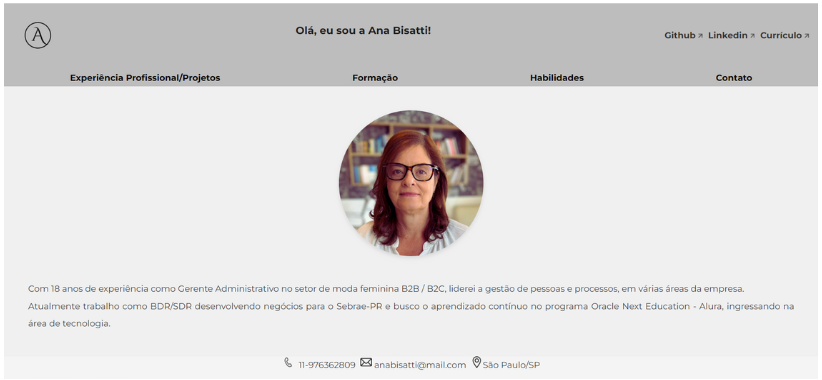

     

Portfólio Web - Ana Bisatti

Este é meu site portfólio desenvolvido como parte do curso Praticando Front End . O projeto tem como objetivo apresentar minhas habilidades e projetos desenvolvidos na área de desenvolvimento web, utilizando HTML, CSS.

🚀 Tecnologias Utilizadas
HTML5 : Estruturação da página.
CSS : Estilização e layout responsivo.

📁 Estrutura do Projeto

index.html : Página principal do portfólio com todos os portfólios (Apresentação, Experiência Profissional, Projetos, Formação Acadêmica e Habilidades).
style.css : Arquivo de estilos que definem o layout da página, incluindo Flexbox para distribuição dos elementos.

Navegação intuitiva : permite uma navegação fácil.

Layout Responsivo : O site é adaptado para diferentes resoluções de tela.

Botões Interativos : Botões como 'Visualizar' nos projetos e 'Enviar' no formulário de contato são interativos, proporcionando uma experiência de usuário agradável.

     

